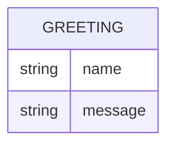

# Domain model

Greeter is stateless — it stores nothing — but every response it returns has
the same small shape, shown below.

A `Greeting` is never persisted: it is computed fresh for each request from
the `name` query parameter and returned directly in the response body.